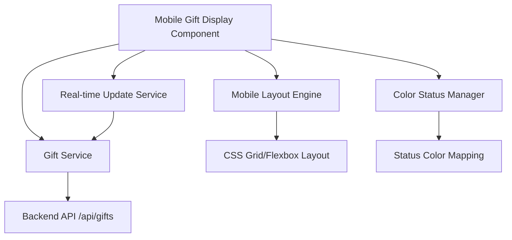

# Design Document

## Overview

The Mobile Gift Display feature adds a dedicated, mobile-optimized page to the existing Secret Santa game application. This component provides a real-time, full-screen view of all gifts with visual status indicators, designed specifically for participants to follow game progress from their mobile devices. The display automatically adapts its layout as gifts are added and updates colors based on steal status.

## Architecture

### High-Level Architecture



### Integration with Existing System

The mobile display integrates seamlessly with the existing Secret Santa application:
- Uses existing `GiftService` for API communication
- Leverages current `/api/gifts` endpoint for data
- Follows established Angular routing patterns
- Maintains consistency with existing error handling

## Components and Interfaces

### 1. Mobile Gift Display Component

#### Component Structure
```typescript
@Component({
  selector: 'app-mobile-gift-display',
  templateUrl: './mobile-gift-display.component.html',
  styleUrls: ['./mobile-gift-display.component.css']
})
export class MobileGiftDisplayComponent implements OnInit, OnDestroy {
  gifts: Gift[] = [];
  loading: boolean = true;
  error: string | null = null;
  private refreshInterval: any;
  
  constructor(
    private giftService: GiftService,
    private errorHandlingService: ErrorHandlingService
  ) {}
}
```

#### Key Methods
- `ngOnInit()`: Initialize component and start real-time updates
- `ngOnDestroy()`: Clean up intervals and subscriptions
- `loadGifts()`: Fetch current gift data from API
- `startRealTimeUpdates()`: Begin polling for updates
- `getGiftStatusClass()`: Determine CSS class based on steal count
- `calculateGridLayout()`: Compute responsive grid dimensions

### 2. Mobile Layout Engine

#### Responsive Grid System
```css
.gift-grid {
  display: grid;
  height: 100vh;
  width: 100vw;
  margin: 0;
  padding: 0;
  gap: 0;
  grid-template-columns: repeat(var(--cols), 1fr);
  grid-template-rows: repeat(var(--rows), 1fr);
}
```

#### Dynamic Layout Calculation
- **1 gift**: 1x1 grid (full screen)
- **2 gifts**: 2x1 grid (horizontal split)
- **3-4 gifts**: 2x2 grid
- **5-6 gifts**: 3x2 grid
- **7-9 gifts**: 3x3 grid
- **10+ gifts**: Dynamic calculation based on screen aspect ratio

### 3. Color Status Manager

#### Status Color Mapping
```typescript
interface GiftStatusColors {
  fresh: { background: '#4CAF50', color: '#424242' };      // Green bg, dark grey text
  stolen_once: { background: '#FFEB3B', color: '#424242' }; // Yellow bg, dark grey text
  stolen_twice: { background: '#F44336', color: '#424242' }; // Red bg, dark grey text
  locked: { background: '#9E9E9E', color: '#FFFFFF' };      // Grey bg, white text
}
```

#### Status Determination Logic
```typescript
getGiftStatus(gift: Gift): keyof GiftStatusColors {
  if (gift.steal_count === 0) return 'fresh';
  if (gift.steal_count === 1) return 'stolen_once';
  if (gift.steal_count === 2) return 'stolen_twice';
  return 'locked'; // 3+ steals
}
```

### 4. Real-time Update Service

#### Polling Strategy
- **Update Interval**: 2 seconds during active game
- **Exponential Backoff**: On network errors
- **Smart Polling**: Reduce frequency when no changes detected
- **Connection Recovery**: Automatic reconnection on network restore

#### Update Detection
```typescript
private hasGiftsChanged(newGifts: Gift[], currentGifts: Gift[]): boolean {
  if (newGifts.length !== currentGifts.length) return true;
  
  return newGifts.some((newGift, index) => {
    const currentGift = currentGifts[index];
    return newGift.steal_count !== currentGift.steal_count ||
           newGift.name !== currentGift.name ||
           newGift.is_locked !== currentGift.is_locked;
  });
}
```

## Data Models

### Extended Gift Interface
```typescript
interface Gift {
  id: string;
  name: string;
  steal_count: number;
  is_locked: boolean;
  current_owner: number | null;
  steal_history: number[];
}

interface GiftDisplayItem extends Gift {
  statusClass: string;
  gridPosition: { row: number; col: number };
  displayText: string;
}
```

### Layout Configuration
```typescript
interface LayoutConfig {
  totalGifts: number;
  columns: number;
  rows: number;
  aspectRatio: number;
  itemHeight: string;
  itemWidth: string;
}
```

## Mobile Optimization Strategy

### Responsive Design Principles
1. **Viewport Optimization**: Use `100vh` and `100vw` for full-screen coverage
2. **Touch-Friendly**: No interactive elements (read-only display)
3. **Performance**: Minimize DOM updates and CSS recalculations
4. **Battery Efficiency**: Optimize polling frequency and animations

### CSS Media Queries
```css
/* Portrait orientation */
@media screen and (orientation: portrait) {
  .gift-grid {
    grid-template-columns: repeat(var(--portrait-cols), 1fr);
    grid-template-rows: repeat(var(--portrait-rows), 1fr);
  }
}

/* Landscape orientation */
@media screen and (orientation: landscape) {
  .gift-grid {
    grid-template-columns: repeat(var(--landscape-cols), 1fr);
    grid-template-rows: repeat(var(--landscape-rows), 1fr);
  }
}

/* Small screens (phones) */
@media screen and (max-width: 480px) {
  .gift-item {
    font-size: clamp(1rem, 4vw, 2rem);
    padding: 0.5rem;
  }
}
```

### Typography Scaling
```css
.gift-item {
  font-size: clamp(1rem, calc(100vh / var(--rows) / 8), 3rem);
  font-weight: 600;
  color: var(--text-color);
  text-align: center;
  display: flex;
  align-items: center;
  justify-content: center;
  word-wrap: break-word;
  hyphens: auto;
}
```

## Error Handling

### Network Error Recovery
```typescript
private handleNetworkError(error: any): void {
  this.error = 'Connection lost. Retrying...';
  this.retryCount++;
  
  const backoffDelay = Math.min(1000 * Math.pow(2, this.retryCount), 30000);
  
  setTimeout(() => {
    this.loadGifts();
  }, backoffDelay);
}
```

### Graceful Degradation
- **Offline Mode**: Show last known state with indicator
- **Slow Network**: Display loading states and progress
- **API Errors**: Show user-friendly error messages
- **Empty State**: Display appropriate waiting message

## Performance Considerations

### Optimization Strategies
1. **Change Detection**: Use `OnPush` strategy for better performance
2. **Virtual Scrolling**: Not needed due to limited gift count (typically < 50)
3. **Memoization**: Cache layout calculations
4. **Debouncing**: Prevent excessive API calls during rapid updates

### Memory Management
```typescript
ngOnDestroy(): void {
  if (this.refreshInterval) {
    clearInterval(this.refreshInterval);
  }
  
  if (this.giftSubscription) {
    this.giftSubscription.unsubscribe();
  }
}
```

## Testing Strategy

### Unit Testing
- Component initialization and lifecycle
- Layout calculation algorithms
- Color status determination
- Error handling scenarios
- Real-time update logic

### Integration Testing
- API service integration
- Route navigation
- Mobile viewport behavior
- Orientation change handling

### Mobile Testing
- Cross-device compatibility (iOS/Android)
- Various screen sizes and resolutions
- Network connectivity scenarios
- Battery usage optimization
- Performance under load

### Test Scenarios
1. **Layout Adaptation**: Test grid calculations for 1-20+ gifts
2. **Color Transitions**: Verify status color changes
3. **Real-time Updates**: Test polling and update detection
4. **Error Recovery**: Network disconnection and reconnection
5. **Performance**: Memory leaks and CPU usage
6. **Accessibility**: Screen reader compatibility and contrast ratios

## Security Considerations

### Data Protection
- Read-only access (no user input)
- No sensitive data exposure
- Standard CORS and API security

### Performance Security
- Rate limiting on API calls
- Prevent excessive polling
- Memory leak prevention

## Deployment Integration

### Routing Configuration
```typescript
// Add to app-routing.module.ts
{
  path: 'mobile-display',
  component: MobileGiftDisplayComponent,
  data: { title: 'Gift Display' }
}
```

### Build Optimization
- Component lazy loading if needed
- CSS optimization for mobile
- Asset compression
- Service worker caching for offline support

## Future Enhancements

### Potential Improvements
1. **WebSocket Integration**: Replace polling with real-time WebSocket updates
2. **Push Notifications**: Alert users of gift status changes
3. **Customizable Themes**: Allow color scheme customization
4. **Animation Effects**: Smooth transitions for status changes
5. **QR Code Access**: Quick mobile access via QR code
6. **Offline Support**: Service worker for offline functionality