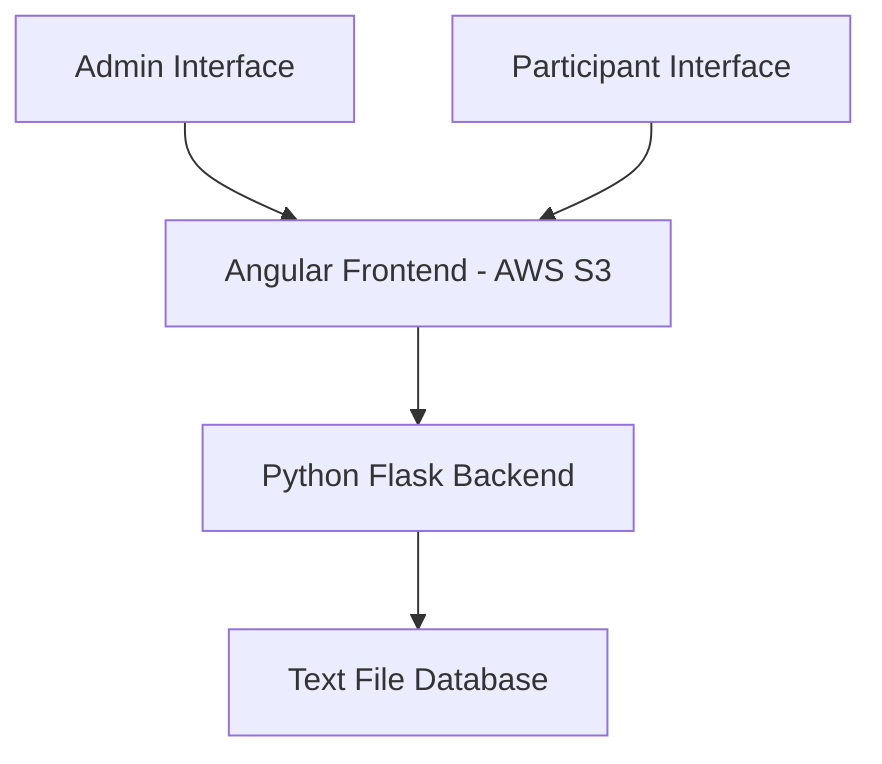

# Design Document

## Overview

The Secret Santa Game application is a web-based system consisting of an Angular frontend deployed on AWS S3 and a Python Flask backend. The system manages participant registration, gift tracking, and game mechanics for up to 100 users. The architecture follows a simple client-server model with a text file serving as the persistent data store.

## Architecture

### High-Level Architecture



### Technology Stack

- **Frontend**: Angular 17+ with TypeScript
- **Backend**: Python Flask with CORS support
- **Database**: Simple text file (JSON format)
- **Deployment**: AWS S3 (frontend), AWS EC2 or similar (backend)
- **Communication**: RESTful API with JSON payloads

## Components and Interfaces

### Frontend Components

#### 1. Registration Component (`registration.component.ts`)
- Handles user name input and registration
- Validates input and displays success/error messages
- Communicates with backend API for participant registration

#### 2. Participants Component (`participants.component.ts`)
- Displays list of all registered participants with their numbers
- Auto-refreshes to show new registrations
- Provides read-only view of current game state

#### 3. Admin Component (`admin.component.ts`)
- Shows current turn information
- Provides gift input functionality
- Displays gift list with steal tracking
- Handles gift stealing interactions and strike management

#### 4. Shared Services

##### ParticipantService (`participant.service.ts`)
- Manages API calls for participant operations
- Handles registration and retrieval of participant data

##### GiftService (`gift.service.ts`)
- Manages gift-related API operations
- Handles gift creation, stealing, and status updates

##### GameService (`game.service.ts`)
- Manages overall game state
- Handles turn management and game flow

### Backend API Endpoints

#### Participant Management
- `POST /api/participants` - Register new participant
- `GET /api/participants` - Get all participants
- `GET /api/participants/count` - Get current participant count

#### Gift Management
- `POST /api/gifts` - Add new gift
- `GET /api/gifts` - Get all gifts with steal status
- `PUT /api/gifts/{gift_id}/steal` - Record gift steal
- `GET /api/gifts/{gift_id}/status` - Get gift steal status

#### Game Management
- `GET /api/game/current-turn` - Get whose turn it is
- `PUT /api/game/next-turn` - Advance to next turn

## Data Models

### Participant Model
```json
{
  "id": "unique_number_1_to_100",
  "name": "participant_name",
  "registration_timestamp": "ISO_datetime"
}
```

### Gift Model
```json
{
  "id": "unique_gift_id",
  "name": "gift_name",
  "steal_count": 0,
  "is_locked": false,
  "current_owner": "participant_id",
  "steal_history": ["participant_id_1", "participant_id_2"]
}
```

### Game State Model
```json
{
  "current_turn": "participant_id",
  "turn_order": ["participant_id_1", "participant_id_2"],
  "game_phase": "registration|active|completed"
}
```

### File Storage Structure
The text file database will store data in JSON format:
```json
{
  "participants": [...],
  "gifts": [...],
  "game_state": {...},
  "metadata": {
    "last_updated": "ISO_datetime",
    "version": "1.0"
  }
}
```

## Error Handling

### Frontend Error Handling
- Network connectivity issues with retry mechanisms
- Input validation with user-friendly error messages
- Loading states and progress indicators
- Graceful degradation when backend is unavailable

### Backend Error Handling
- File locking mechanisms for concurrent access
- Atomic operations for critical data updates
- Comprehensive error responses with appropriate HTTP status codes
- Logging for debugging and monitoring

### Concurrent Access Management
- File-based locking using Python's `fcntl` module
- Retry logic with exponential backoff for failed operations
- Transaction-like behavior for multi-step operations
- Validation of data integrity before and after operations

## Testing Strategy

### Frontend Testing
- Unit tests for components using Jasmine/Karma
- Integration tests for services and API communication
- E2E tests using Protractor or Cypress for user workflows
- Mock services for isolated component testing

### Backend Testing
- Unit tests for API endpoints using pytest
- Integration tests for file operations and data persistence
- Concurrent access testing to validate race condition handling
- Load testing for multiple simultaneous registrations

### Test Scenarios
1. **Registration Race Conditions**: Multiple users registering simultaneously
2. **Gift Stealing Limits**: Ensuring gifts lock after 3 steals
3. **Data Persistence**: Verifying data survives server restarts
4. **Error Recovery**: Testing system behavior during failures
5. **Capacity Limits**: Testing behavior at 100 participant limit

## Security Considerations

### Input Validation
- Sanitize all user inputs to prevent injection attacks
- Validate participant names for appropriate length and characters
- Ensure gift names meet acceptable criteria

### Data Protection
- Implement basic rate limiting to prevent abuse
- Validate all API requests for proper format and authorization
- Secure file access permissions on the server

### Deployment Security
- HTTPS enforcement for all communications
- CORS configuration to allow only authorized origins
- Environment-specific configuration management

## Performance Considerations

### Frontend Optimization
- Lazy loading for components
- Efficient change detection strategies
- Minimal API calls with appropriate caching

### Backend Optimization
- Efficient file I/O operations
- Minimal file locking duration
- Optimized JSON parsing and serialization

### Scalability Notes
- Current design supports up to 100 participants as specified
- File-based storage is suitable for this scale
- Future migration path to database if needed